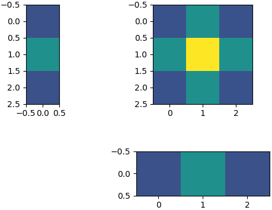

# Separate 2D convolution kernels

**Separating a 2D kernel** (matrix `M`) into **two 1D kernels** (column vector `C` and row vector `R`) allows for
**faster execution** of the convolution operation.

Here is an example of a 2D kernel separated into two 1D kernels:


# Installation

* Clone the repository
* Go to the root level of the repository (where setup.py is located)
* Execute `pip install .`

# How to use it

Example of how to use the package:

````python
import numpy as np

from separate_kernel import separate_kernel

M = np.array([[1, 2, 1], [2, 4, 2], [1, 2, 1]])
res = separate_kernel(M, symmetric_kernel=True)

print(f'1st 1D filter: {res.col_vec.flatten()}.T')
print(f'2nd 1D filter: {res.row_vec.flatten()}')
print(f'Multiplying 1st and 2nd 1D filter gives original 2D filter:')
print(res.col_vec @ res.row_vec)
````

This outputs:

````text
1st 1D filter: [1. 2. 1.].T
2nd 1D filter: [1. 2. 1.]
Multiplying 1st and 2nd 1D filter gives original 2D filter:
[[1. 2. 1.]
 [2. 4. 2.]
 [1. 2. 1.]]
 ````

# Notes

For a 2D kernel to be separable the rank of the matrix `M` must be 1.
For a separable kernel the equation `M = C * R` holds.
The method uses nonlinear least squares to minimize the residuals `C * R - M`.
Therefore, even if a kernel can not be perfectly separated, still an approximation will be output.

Also, SVD could be used to compute `C` and `R`, as in the case of separability there is only one nonzero singular value 
and the corresponding singular vectors represent (scaled versions of) `C` and `R`.